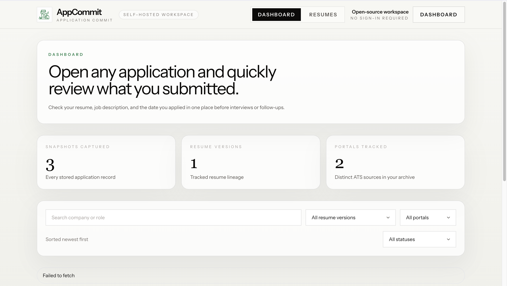
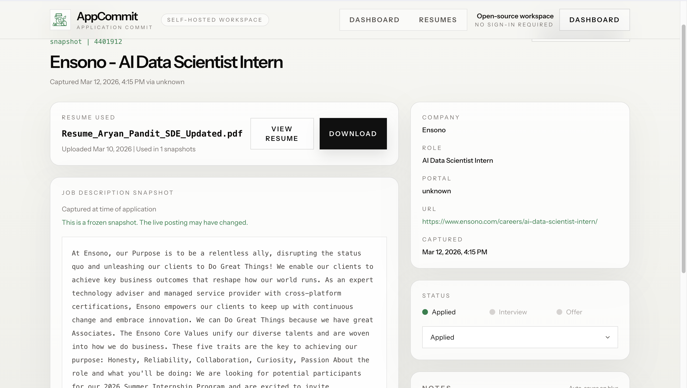
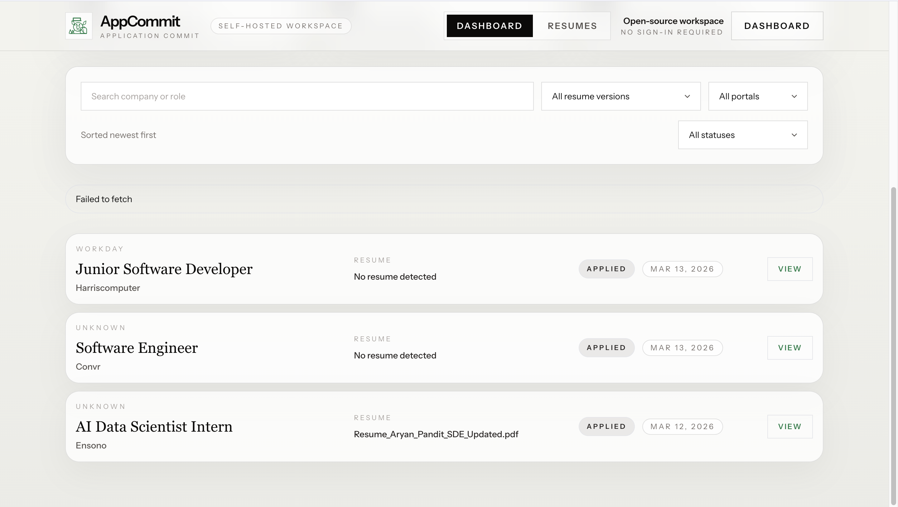
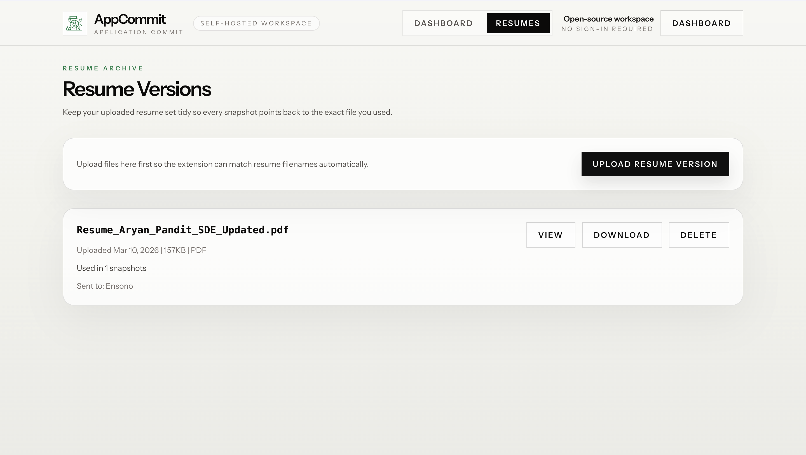

<p align="center">
  
</p>

<h1 align="center">AppCommit</h1>

<p align="center">
  <strong>The job application version control system. Never lose track of what you submitted.</strong>
</p>

<p align="center">
  
  
  
  
  
  
</p>

---

AppCommit is an open-source application tracking workspace designed for **recall**. When you apply for a job, the AppCommit extension automatically captures the job title, company, exact job description, and the resume you used, saving it to your personal dashboard.

When you get that interview invitation days or weeks later, you can instantly see exactly what you sent—even if the original job post has been taken down.

## 📸 Project Gallery

<div align="center">
  
</div>

<br/>

<div align="center">
  
  
  
</div>

## ✨ Key Features

- **🚀 Automatic Capture**: Detects when you're on a job portal and offers to save your application context.
- **📄 JD Snapshots**: Saves the full job description text locally so you have it even if the listing is deleted.
- **📂 Resume Tracking**: Matches your application with the specific resume version you uploaded.
- **🤖 Intelligent Parsing**: 
  - **Native Support**: High-accuracy selectors for Greenhouse, Workday, and Lever.
  - **LLM Fallback**: Uses Claude (LLM) to extract data from any other career site.
  - **Manual Mode**: Quick-edit fields if automated detection needs a nudge.
- **🛡️ Privacy First**: Your data stays in your own Supabase instance. No central service tracking your applications.

## 🏗️ How It Works

AppCommit uses a browser extension to bridge the gap between job portals and your personal dashboard.

1. **Upload**: Add your different resume versions (PDF/Word) to your dashboard.
2. **Apply**: Open any supported job portal (Greenhouse, Workday, Lever, etc.).
3. **Capture**: 
   - **Mode 1 (Manual)**: Click "Save Application" in the extension sidebar.
   - **Mode 2 (Auto)**: Extension intercepts the "Submit" click and captures data automatically.
4. **Recall**: When an interview is scheduled, open AppCommit to review the exact context.

> [!TIP]
> Use the LLM fallback for non-standard company career pages to get structured data extraction automatically.

## 🛠️ Quick Start

### Prerequisites
- [Node.js](https://nodejs.org/) (v18+)
- [Python 3.10+](https://www.python.org/)
- [Docker & Compose](https://www.docker.com/) (recommended)
- A [Supabase](https://supabase.com/) account (for database and storage)

### Installation

1. **Clone & Setup**
   ```bash
   git clone https://github.com/your-repo/AppCommit.git
   cd AppCommit
   cp .env.example .env
   ```

2. **Start Services**
   Using Docker (easiest):
   ```bash
   docker compose up --build
   ```
   Or manually:
   - **Backend**: `cd backend && pip install -r requirements.txt && uvicorn main:app --reload`
   - **Frontend**: `cd frontend && npm install && npm run dev`

3. **Install Extension**
   - Run `node scripts/generate-extension-config.mjs` to sync extension config with `.env`.
   - Open Chrome Extensions (`chrome://extensions`).
   - Enable "Developer mode".
   - Click "Load unpacked" and select the `extension/` folder.

## ⚙️ Configuration

Use the `.env` file in the root directory to configure the application.

| Variable | Description |
| --- | --- |
| `SUPABASE_URL` | Your Supabase project URL. |
| `SUPABASE_SERVICE_KEY` | Service role key for backend operations. |
| `SUPABASE_RESUME_BUCKET` | Name of the bucket to store resumes. |
| `ANTHROPIC_API_KEY` | (Optional) API key for Claude LLM parsing. |
| `ANTHROPIC_MODEL` | Model version for LLM parsing (e.g., `claude-3-5-sonnet-20240620`). |
| `VITE_API_URL` | Backend URL for the frontend. |
| `EXTENSION_API_BASE_URL` | Backend URL for the extension. |

## 📖 Documentation

Detailed guides for each component:
- 🎨 [**Frontend**](./docs/FRONTEND.md) - React/Tailwind dashboard.
- ⚙️ [**Backend**](./docs/BACKEND.md) - FastAPI and database schema.
- 🧩 [**Extension**](./docs/EXTENSION.md) - Chrome extension architecture.
- 🔍 [**Parsers**](./docs/PARSERS.md) - Deep dive into ATS and LLM extraction logic.

