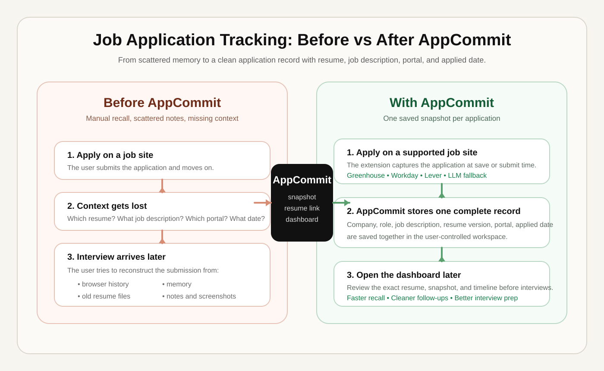

<h1 align="center">AppCommit</h1>

<p align="center">
  <strong>Automatically capture the job description, role, resume, portal, and applied date and time for every application.</strong>
</p>

<p align="center">
  
  
  
  
  
  
</p>

<br>

AppCommit is an open-source job application tracking workspace built for recall. Instead of only saving company names and statuses, it stores the actual submission context so you can later open one record and see:

- the exact job description
- the role and company
- the resume version you used
- the portal where you applied
- the applied date and time

That matters because interviews usually happen days or weeks later. By then, the job post may change, the company page may disappear, and it is easy to forget which resume version you sent. AppCommit keeps that context accessible in one place.

<p align="center">
  
</p>

---

## Quick Start

```bash
git clone <your-fork-or-repo-url>
cd AppCommit
cp .env.example .env
docker compose up --build
node scripts/generate-extension-config.mjs
```

This starts:

- frontend on `http://localhost:5173`
- backend on `http://localhost:8000`

Then load the `extension/` directory as an unpacked browser extension.

---

## What AppCommit Captures

When you apply on a supported job site, AppCommit can save:

- job title / role
- company name
- job description snapshot
- resume filename or matched resume version
- application portal
- applied date and time
- source URL

Later, you can open the dashboard and review that exact record before interviews, recruiter follow-ups, or status updates.

---

## How It Works

1. Upload your resumes in the dashboard.
2. Open a supported application page.
3. The extension detects the page and captures the submission details.
4. The backend stores the snapshot in your configured Supabase project.
5. You reopen the application later from the dashboard with the original context intact.

Supported portals out of the box:

- Greenhouse
- Workday
- Lever

For unsupported sites, AppCommit can use an LLM fallback parser to extract the company, role, and job description from the page content.

---

## Why The LLM Is Needed

Some job portals have predictable HTML, so AppCommit can parse them directly with hardcoded selectors. That is the fastest and most reliable path.

But many companies use custom career pages or heavily customized forms. In those cases, the HTML structure is inconsistent and normal selectors are not enough. The LLM fallback exists to:

- identify the job title on unknown pages
- identify the company name when the page structure is unusual
- extract the job description from noisy page content
- return structured data for the save flow

Without the LLM fallback, AppCommit would only work well on a small set of known ATS platforms.

---

## Environment Variables

Use the root `.env.example` as the source of truth for local setup.

| Variable | Why it is needed |
| --- | --- |
| `SUPABASE_URL` | Connects the backend to your Supabase project. |
| `SUPABASE_SERVICE_KEY` | Lets the backend read and write application and resume records securely. |
| `SUPABASE_RESUME_BUCKET` | Tells the backend which storage bucket should hold uploaded resumes. |
| `ANTHROPIC_API_KEY` | Used by the backend when the LLM fallback parser needs to read an unsupported job page. |
| `ANTHROPIC_MODEL` | Selects the model used for fallback parsing of unknown job portals. |
| `VITE_API_URL` | Tells the frontend where the backend API is running. |
| `EXTENSION_API_BASE_URL` | Tells the browser extension where to send captured application data. |
| `EXTENSION_DASHBOARD_URL` | Lets the extension open the main web dashboard. |
| `EXTENSION_DASHBOARD_APP_URL` | Lets the extension jump directly to the dashboard application view. |

### Example

```env
SUPABASE_URL=https://your-project.supabase.co
SUPABASE_SERVICE_KEY=your-supabase-service-key
SUPABASE_RESUME_BUCKET=resumes

ANTHROPIC_API_KEY=your-anthropic-api-key
ANTHROPIC_MODEL=claude-sonnet-4-20250514

VITE_API_URL=http://localhost:8000

EXTENSION_API_BASE_URL=http://localhost:8000
EXTENSION_DASHBOARD_URL=http://localhost:5173
EXTENSION_DASHBOARD_APP_URL=http://localhost:5173/dashboard
```

If you do not want LLM fallback parsing, you can leave the Anthropic values unset, but parsing on unsupported portals will not work.

---

## Repository Structure

```text
AppCommit/
├── frontend/    # React dashboard
├── backend/     # FastAPI API
├── extension/   # Browser extension
├── supabase/    # SQL migrations
├── docs/        # Product and architecture notes
├── scripts/     # Project utilities
└── .env.example # Shared environment template
```

---

## Manual Development

### Frontend

```bash
cd frontend
npm install
npm run dev
```

### Backend

```bash
cd backend
python -m venv .venv
source .venv/bin/activate
pip install -r requirements.txt
uvicorn main:app --reload --port 8000
```

### Extension

```bash
node scripts/generate-extension-config.mjs
```

Then load `extension/` as an unpacked extension in your browser.

---

## API

The backend exposes:

- `/health`
- `/api/applications`
- `/api/resumes`
- `/api/auth`
- `/api/parse-llm`

Open `http://localhost:8000/health` to verify the API is up.

---

## Privacy Model

AppCommit is designed around user-controlled storage. Application records and resumes are stored in the database and storage services you configure for your own deployment. The project is intended to help users manage their own application history, not collect it for a centralized service.

---

## Documentation

- [Frontend notes](./docs/FRONTEND.md)
- [Backend notes](./docs/BACKEND.md)
- [Extension notes](./docs/EXTENSION.md)
- [Parser notes](./docs/PARSERS.md)

---

## Contributing

Issues and pull requests are welcome. If you plan to make larger changes, open an issue first so implementation direction is clear before work starts.
